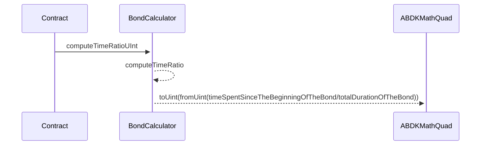
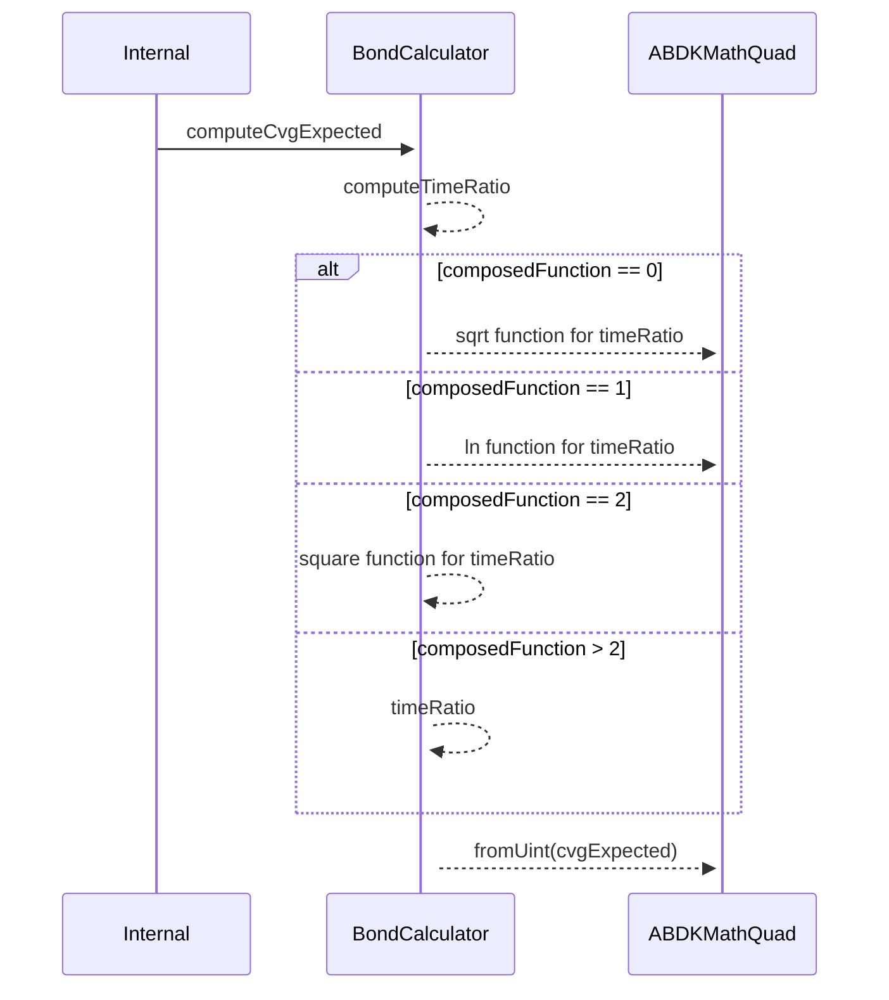
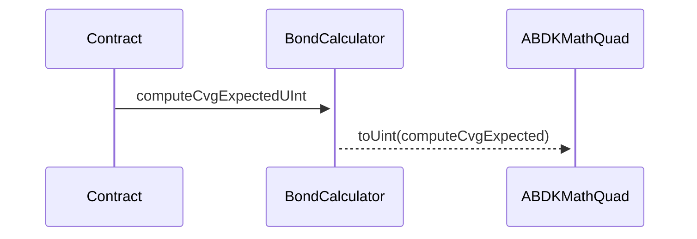
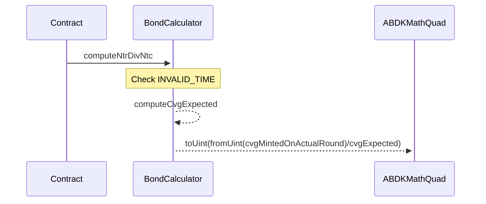
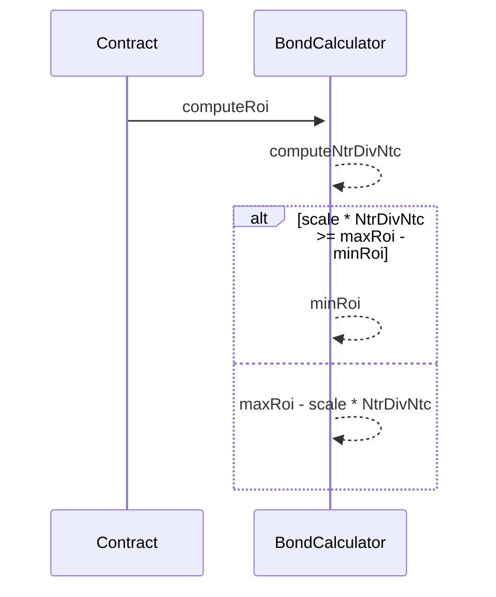

# BondCalculator

This contract allows to compute the discount of a bond. This computation is done on the fly of a deposit. Which means that the ROI of the bond is adjusted automatically. It uses the `ABDKMathQuad` library to preserve precision when math operation with a floating number happens and specific functions are needed such as **ln**.

To keep it simple:

- The closer we get to the end duration of the bond, the higher the ROI will be
- The closer we get to the sold target, the lower the ROI will be.

## Compute ROI Bond

The `BondCalculator` contract aims to compute the proper ROI (Return Of Investment) of a bond.
ROI changes according to :

- The time _t_ passed since the creation of the bond, compared to the end of the bond _T_
- Distributed CVG _Ntr_
- Max CVG to be distributed _maxDistr_
- The composed function type _func_ (sqrt, ln, square or linear)
- The _minRoi_ & _maxRoi_ configured

$Ntc = func(t/T) * maxCapacity$

$Ratio = ( Ntr / Ntc ) / Gamma$

$ROI = maxROI - ratio * scale$

### Compute Time Ratio Uint

### Compute Cvg Expected

### Compute Cvg Expected Uint

### Compute Ntr/Ntc

### Compute ROI

