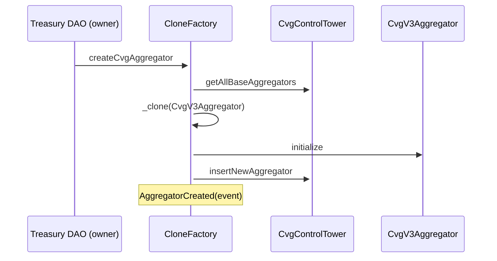

# Clone Factory

## Description

The purpose of this contract is to create three new contract types: Bond, TAssetStaking and cvgAggregator by cloning a base contract previously deployed, through the Minimal Proxy (EIP-1167).
More information about this implementation there: https://eips.ethereum.org/EIPS/eip-1167

There is a versioning system that allows us to update the base contracts so that future cloned contracts use a new implementation as the base.

Newly created contracts are always initialized with default values and are stored in the `CvgControlTower` contract.

### createCvgAggregator

