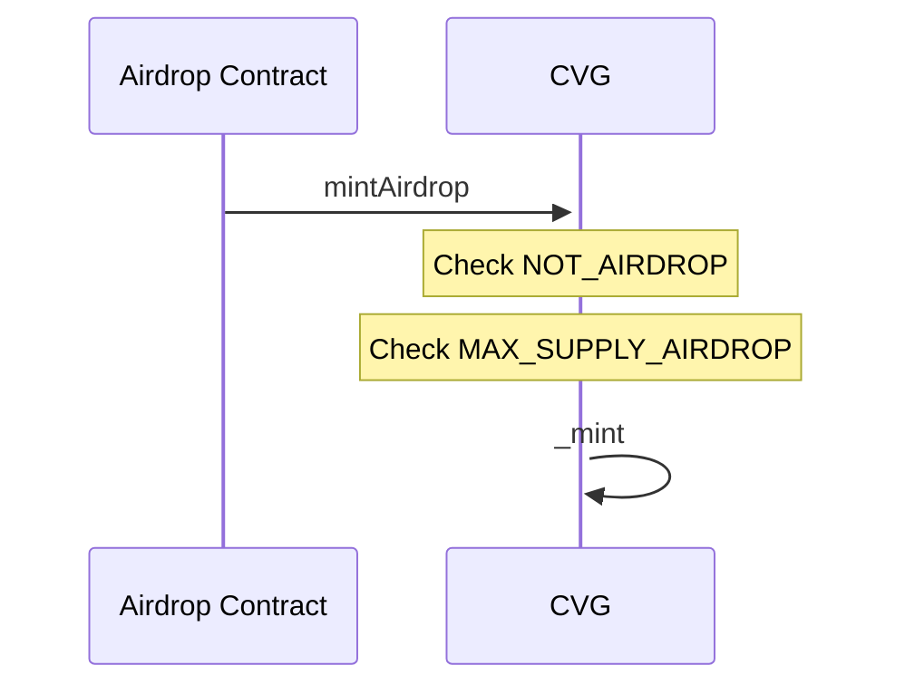

# CVG - Convergence Token

## Description

The Convergence token follows the ERC-20 protocol standards.
This is a mintable token with a maximum supply of `150.000.000` tokens with a distribution divided into four categories:

- Airdrop (`1.500.000` tokens)
- Vesting supply (`40.500.000` tokens)
- Bonds supply (`45.000.000` tokens) [NOT PRESENT IN THE CONTRACT]
- Stakings supply (`63.000.000` tokens) [NOT PRESENT IN THE CONTRACT]

When deployed, the total vesting supply will automatically be minted to the corresponding address of the vesting contract.
The burning system implemented on this token leads to the total supply being reduced and therefore the maximum supply.

### mintAirdrop

