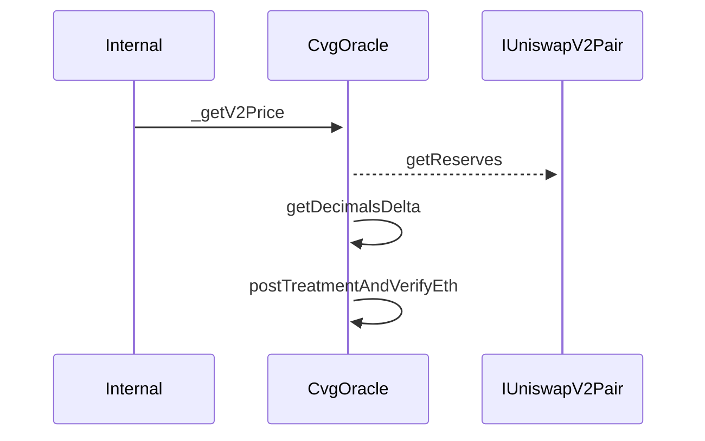
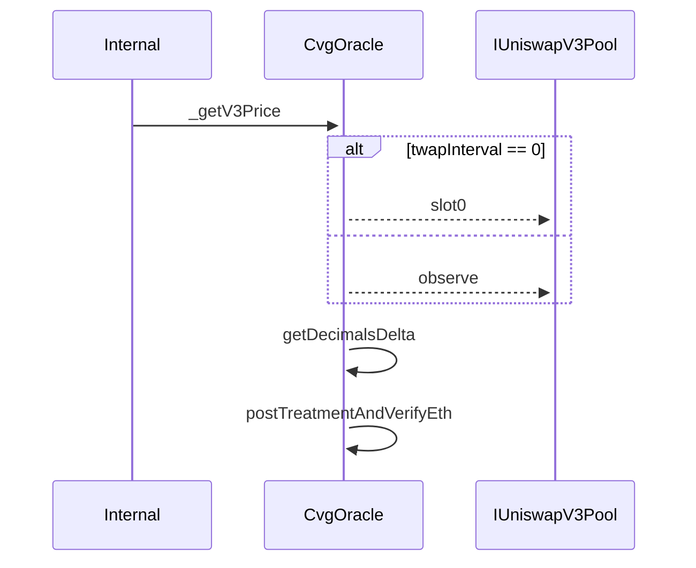
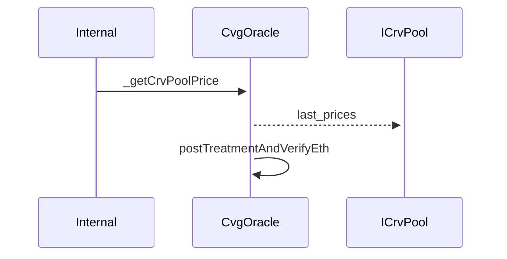
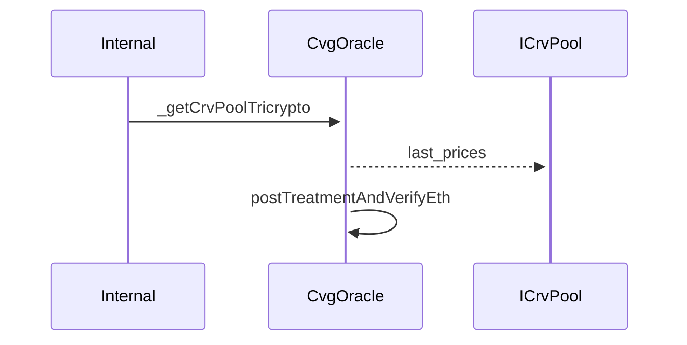
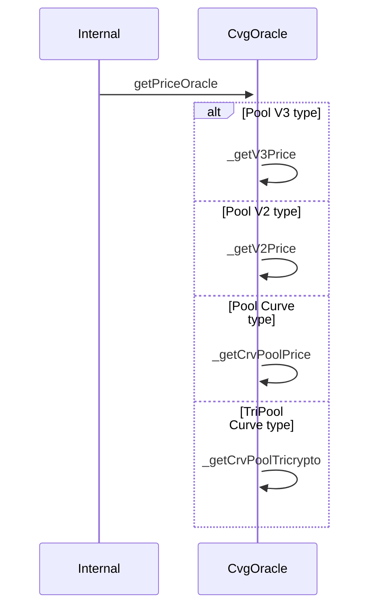
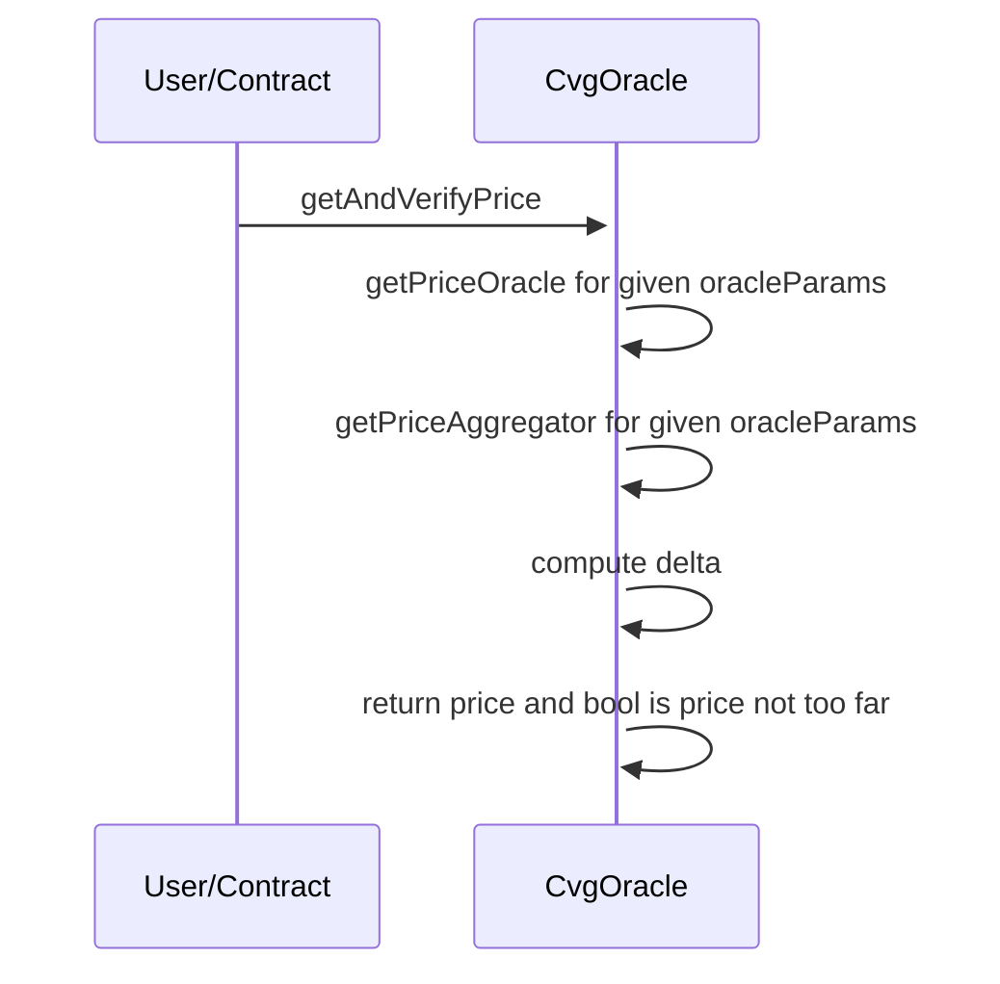
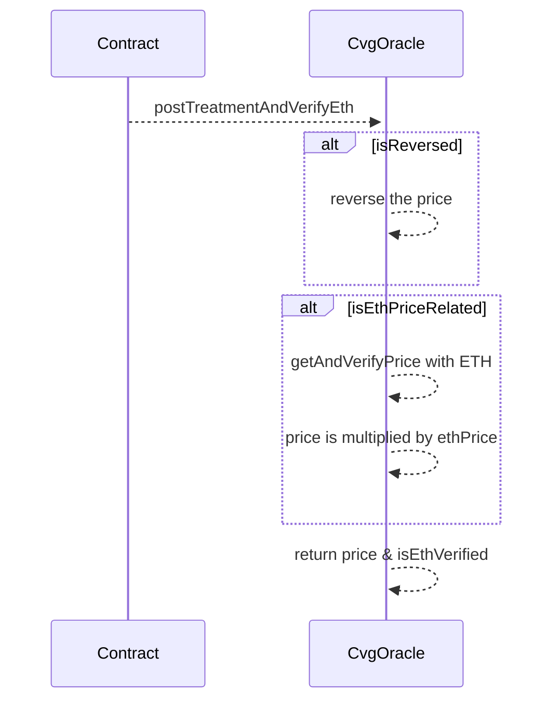

# CvgOracle

## Description

This contract allows to compute prices of the assets proposed through the Bond program in USD$.

`CvgOracle` contract ensures that asset price found in Liquid Pool is not too distant from the aggregatorOracle price.

To check that, this contract will retrieve the current price based on the pool type\* (Univ2 or Univ3, or Curve) and then compare that to the latest aggregatorOracle price with a delta parameter (in %) set by the team.
This kind of check will secure the protocol from possible arbitrary liquidity attacks.

## Get V2 Price

## Get V3 Price

## Get CrvPool Price

## Get CrvTriPool Price

## Get Price Oracle

### Verify Price

### Post Treatment and Verify Eth

This function allows to align all prices computed by the Oracle to 18 decimals, whatever the number of decimals of the token and the way Uniswap or Curve compute the price. Also, if the price computation passes through a pool that involves ETH and not a stablecoin, we return a boolean that is the result of the price verification between CvgOracle & ChainlinkAggregator.

