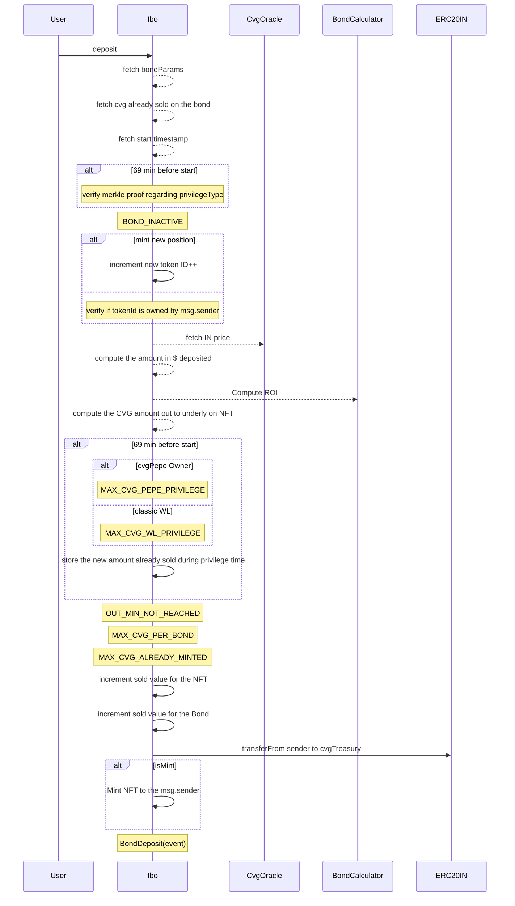

# Ibo

## Description

The IBO (Initial Bond Offering) is a contract allowing users to invest into $CVG$ at a variable discount price compared to the launch price of 0.33$.
Once the investment done, the user receives an NFT with an underlying value of CVG that he will be able to claim in the `VestingCvg` after the launch, regarding the vesting schedule setup.

Users are able to invest in FRAX, CRV and CVX, the price in $ of those assets is directly fetched in a corresponding LP configured in the `CvgOracle`. Prices fetched in the LP are verified through a Chainlink Aggregator and a delta in % .To protect ourselves from liquidity attacks, if the price fetched on the LP is too much further from the Aggregator one, for security reason, the deposit is canceled.

Each bond is linked to one asset and has a maximum number of CVG to sold.

It uses the `BondCalculator` & `CvgOracle` in order to :

- Compute the actual ROI regarding the filling and the time spent since the beginning of the IBO
- Compute / fetches prices of FRAX, CRV and CVX

An IBO NFT owner can deposit using the same NFT, increasing its underlying CVG value claimable after the launch.

During the first 69 minutes, only addresses present in the 2 different merkle trees are able to invest in the IBO.
Each addresses having this privilege can buy a maximum amount of CVG during this privilege time.

Each deposit transaction cannot provide more than N% of the total amount CVG allocated to each bond.

## Deposit IBO

