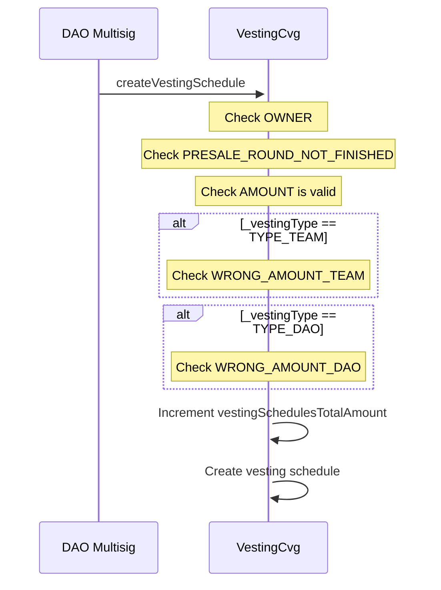
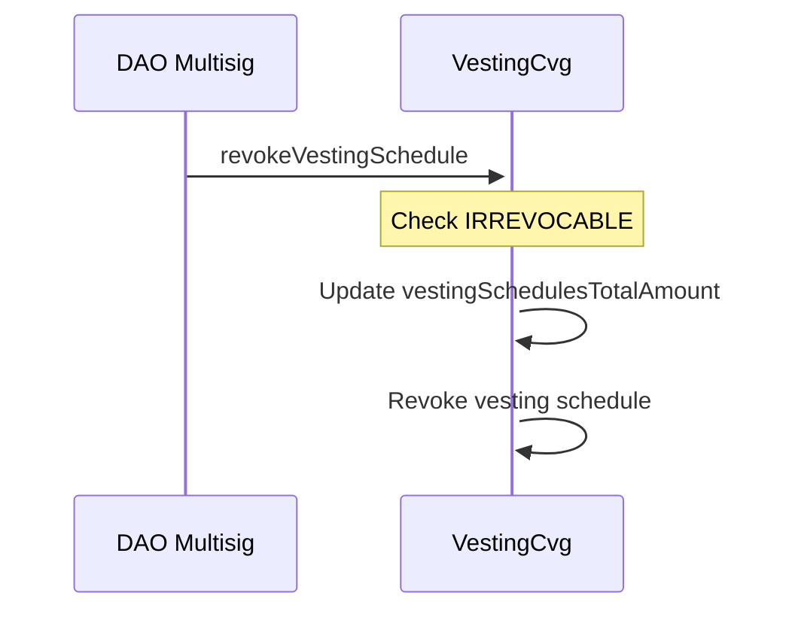
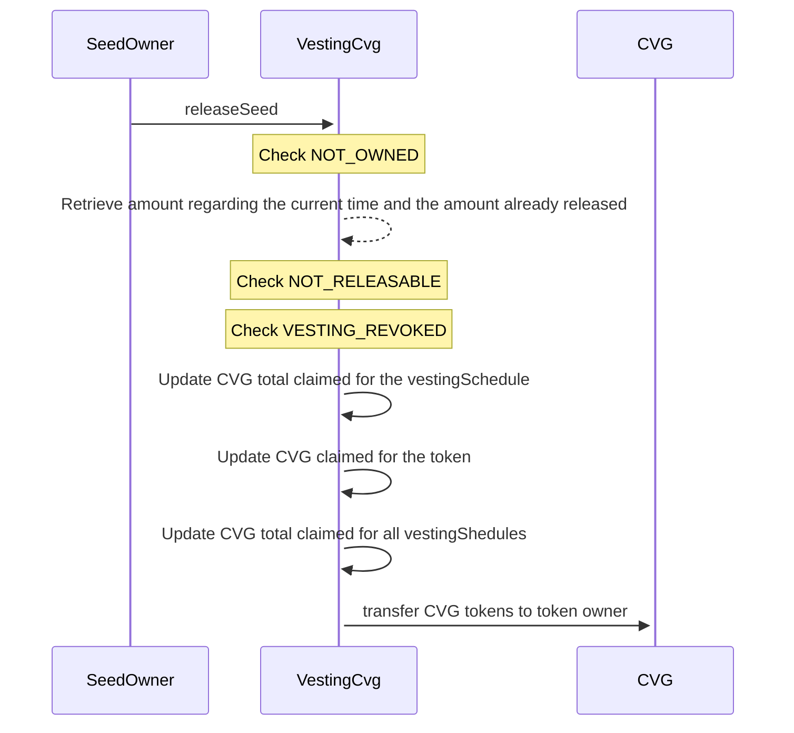
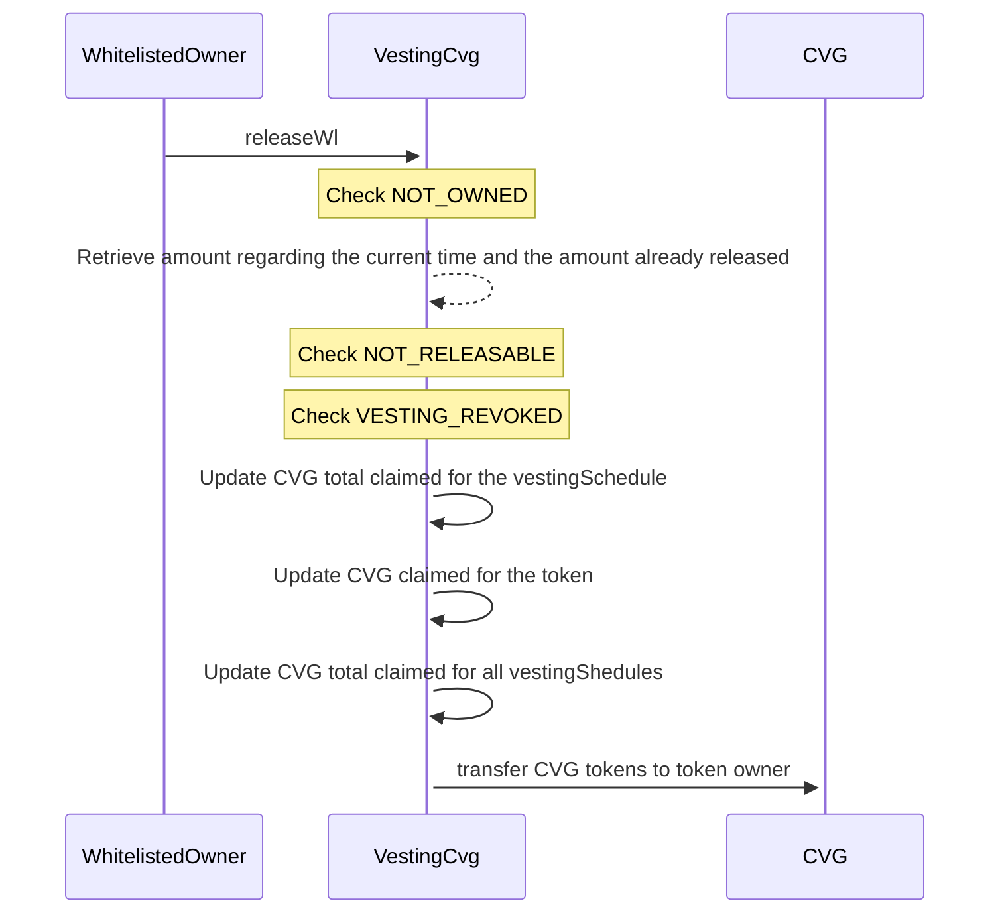
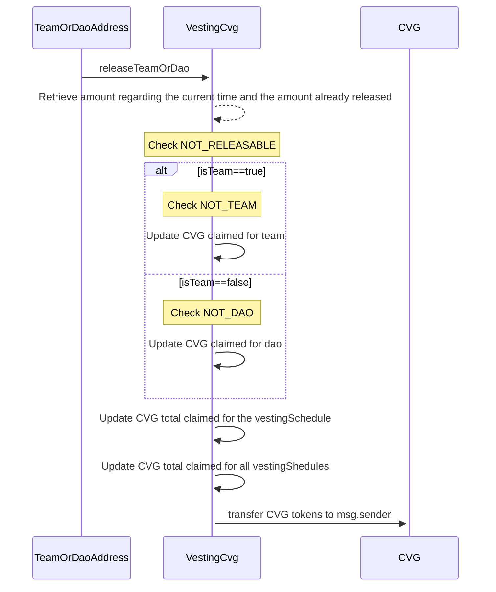

# VestingCvg

## Description

The `VestingCvg` is used to vest in the time the CVG token for seeders, presalers, ibo, team and the dao.
Owner of this contract will need to transfer CVG tokens on it and create the vesting schedule associated to the type of the vesting, to lock the CVGs into it.
Only users who owns the NFTs from `SeedPresaleCvg`, `WlPresaleCvg` and `Ibo` can `release` the associated CVG to the given NFT.
For the team and dao allocation, only the associated addresses will be able to `releaseTeamOrDao`.

## CreateVestingSchedule

## RevokeVestingSchedule

## ReleaseSeed

## ReleaseWl

## ReleaseIbo

## ReleaseTeamOrDao

